# QA Automation · Playwright

<div align="center">

Automatización de pruebas funcionales sobre DemoBlaze utilizando Playwright + TypeScript.

Universidad Mariano Gálvez de Guatemala<br>
Curso: Aseguramiento de la Calidad del Software<br>
Estudiante: Guillermo Jose Gomez Aguilera<br>
Carné: 1790-22-16429

</div>

<div align="center">

[](https://playwright.dev/)
[](https://www.typescriptlang.org/)
[](https://nodejs.org/)
[](#estado-de-los-laboratorios)
[](https://github.com/)

</div>

---

## Sobre el proyecto

Este repositorio presenta el desarrollo de un conjunto de laboratorios de automatización de pruebas realizado durante el curso de Aseguramiento de la Calidad del Software. El proyecto se enfoca en la validación funcional de la aplicación web DemoBlaze mediante herramientas modernas de testing automatizado.

A lo largo del trabajo se implementaron pruebas funcionales automatizadas y flujos end-to-end que cubren aspectos como navegación, validación de interfaces, selección de elementos, acciones de usuario, manejo de diálogos, capturas de evidencia y ejecución de flujos reales de interacción con la aplicación.

---

## Estado de los laboratorios

La siguiente tabla resume el alcance de los laboratorios implementados y su estado final de ejecución.

| Laboratorio | Tema | Tests | Estado |
|---|---|---:|---|
| Clase 01 | Introducción a Playwright | 3 | ✅ Completado |
| Clase 02 | Navegación, esperas y capturas | 4 | ✅ Completado |
| Clase 03 | Locators en Playwright | 9 | ✅ Completado |
| Clase 04 | Actions y flujo funcional | 7 | ✅ Completado |
| **Total** |  | **23** | **✅ Completado** |

---

## Navegación

- [Sobre el proyecto](#sobre-el-proyecto)
- [Tecnologías](#tecnologías-y-herramientas)
- [Laboratorio 01](#laboratorio-01--introducción-a-playwright)
- [Laboratorio 02](#laboratorio-02--navegación-esperas-y-capturas)
- [Laboratorio 03](#laboratorio-03--locators-en-playwright)
- [Laboratorio 04](#laboratorio-04--actions-y-flujo-funcional-en-playwright)
- [Evidencias](#evidencias-destacadas)
- [Estructura del proyecto](#estructura-del-proyecto)
- [Ejecución](#ejecución)
- [Documentación adicional](#documentación-adicional)

---

## Tecnologías y herramientas

El proyecto fue desarrollado con un conjunto de herramientas orientadas a la automatización de pruebas funcionales y a la documentación técnica del proceso.

| Tecnología | Uso |
|---|---|
| Playwright | Automatización de pruebas end-to-end |
| TypeScript | Desarrollo de los tests |
| Node.js | Entorno de ejecución |
| Chromium | Navegador utilizado para las pruebas |
| Git | Control de versiones |
| GitHub | Repositorio y documentación |

---

## Laboratorio 01 · Introducción a Playwright

> Objetivo: validar la carga inicial de la aplicación y la visibilidad de los elementos principales del menú.

### Desarrollo del laboratorio

En este laboratorio se realizaron las primeras pruebas automatizadas sobre la interfaz de DemoBlaze, con el fin de verificar la carga correcta de la página principal y la disponibilidad de los elementos básicos de navegación.

### Pruebas implementadas

| # | Prueba | Estado |
|---|---|---|
| 1 | Página carga correctamente | ✅ |
| 2 | Menú de categorías visible | ✅ |
| 3 | Navbar contiene enlaces principales | ✅ |

### Ejecutar laboratorio

```bash
npx playwright test tests/clase01.spec.ts
```

### Evidencias

<details>
<summary><strong>📸 Test 1 · Página cargada correctamente</strong></summary>

<br>


</details>

<details>
<summary><strong>📸 Test 2 · Menú de categorías visible</strong></summary>

<br>


</details>

<details>
<summary><strong>📸 Test 3 · Navbar con enlaces principales</strong></summary>

<br>


</details>

<details>
<summary><strong>✅ Resultado general · 3 pruebas aprobadas</strong></summary>

<br>


</details>

<details>
<summary><strong>📊 Reporte HTML de Playwright</strong></summary>

<br>


</details>

---

## Laboratorio 02 · Navegación, esperas y capturas

> Objetivo: comprobar la navegación entre páginas, la carga de contenido y la generación de capturas de evidencia.

### Desarrollo del laboratorio

Este laboratorio permitió validar la interacción del usuario con distintos elementos de la aplicación, incluyendo el recorrido hacia el carrito, la apertura del detalle de un producto y la captura visual de componentes clave de la interfaz.

### Pruebas implementadas

| # | Prueba | Estado |
|---|---|---|
| 1 | Navegar al carrito y regresar | ✅ |
| 2 | Abrir detalle de un producto | ✅ |
| 3 | Capturar navbar y footer | ✅ |
| 4 | Verificar tiempo de carga | ✅ |

### Ejecutar laboratorio

```bash
npx playwright test tests/clase02.spec.ts
```

### Evidencias

<details>
<summary><strong>📸 Test 1 · Navegar al carrito y regresar</strong></summary>

<br>


</details>

<details>
<summary><strong>📸 Test 2 · Abrir detalle de un producto</strong></summary>

<br>


</details>

<details>
<summary><strong>📸 Test 3 · Navbar y footer</strong></summary>

<br>


</details>

<details>
<summary><strong>📸 Test 4 · Tiempo de carga</strong></summary>

<br>


</details>

<details>
<summary><strong>✅ Resultado general · 4 pruebas aprobadas</strong></summary>

<br>


</details>

---

## Laboratorio 03 · Locators en Playwright

> Objetivo: practicar diferentes técnicas de localización de elementos en la interfaz de DemoBlaze.

### Desarrollo del laboratorio

En este laboratorio se exploraron distintos tipos de locators y estrategias de selección de elementos, con el propósito de fortalecer la precisión y estabilidad de las pruebas automatizadas.

### Pruebas implementadas

| # | Prueba | Estado |
|---|---|---|
| 1 | Locator por texto | ✅ |
| 2 | Locator por CSS | ✅ |
| 3 | Locator por ID | ✅ |
| 4 | Locator por atributo | ✅ |
| 5 | Locators encadenados | ✅ |
| 6 | Negación de elementos | ✅ |
| 7 | Reto 1: Place Order con getByRole | ✅ |
| 8 | Reto 2: producto con filter | ✅ |
| 9 | Reto 3: selector por atributo parcial | ✅ |

### Ejecutar laboratorio

```bash
npx playwright test tests/clase03.spec.ts
```

### Evidencias

<details>
<summary><strong>📸 Test 1 · Locator por texto</strong></summary>

<br>

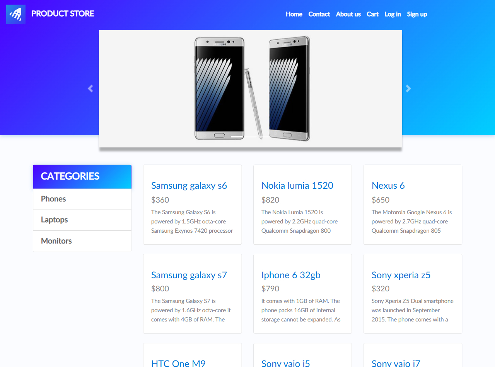

</details>

<details>
<summary><strong>📸 Test 2 · Locator por CSS</strong></summary>

<br>

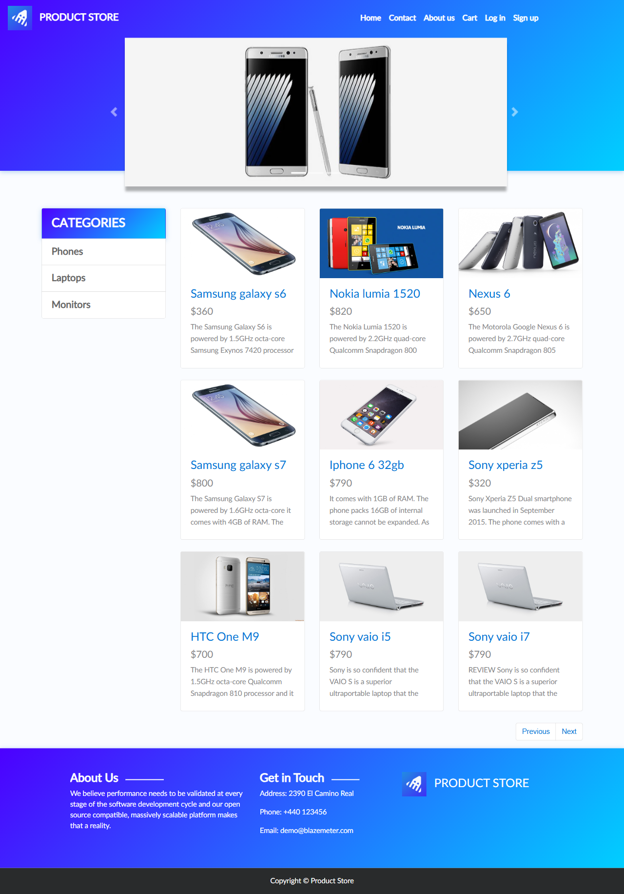

</details>

<details>
<summary><strong>📸 Test 3 · Locator por ID</strong></summary>

<br>

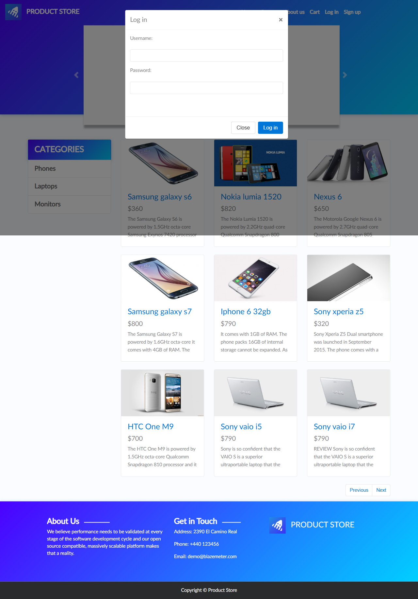

</details>

<details>
<summary><strong>📸 Test 4 · Locator por atributo</strong></summary>

<br>

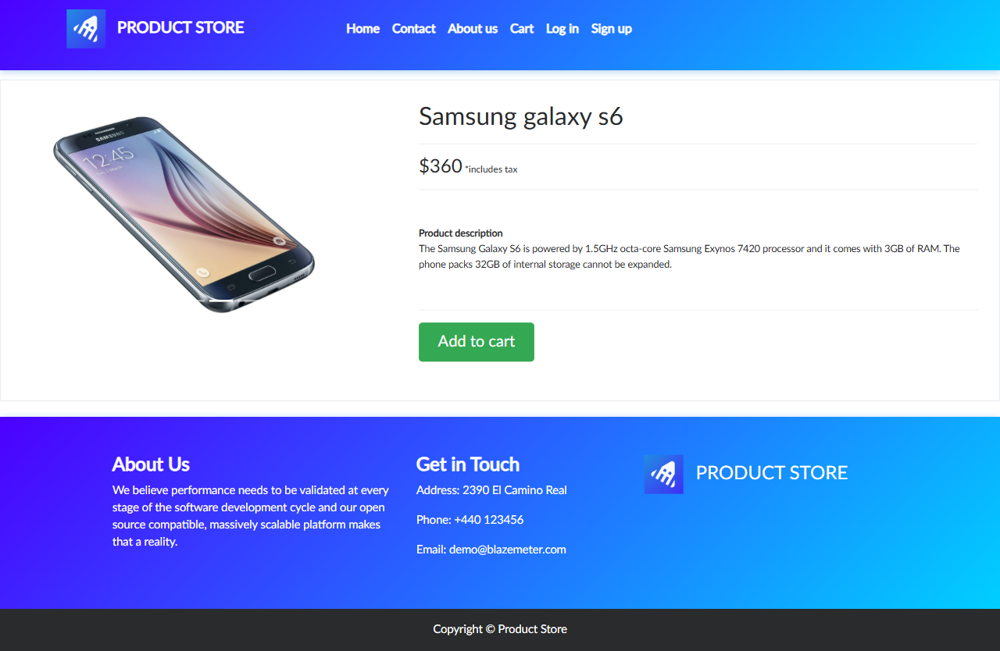

</details>

<details>
<summary><strong>📸 Test 5 · Locators encadenados</strong></summary>

<br>

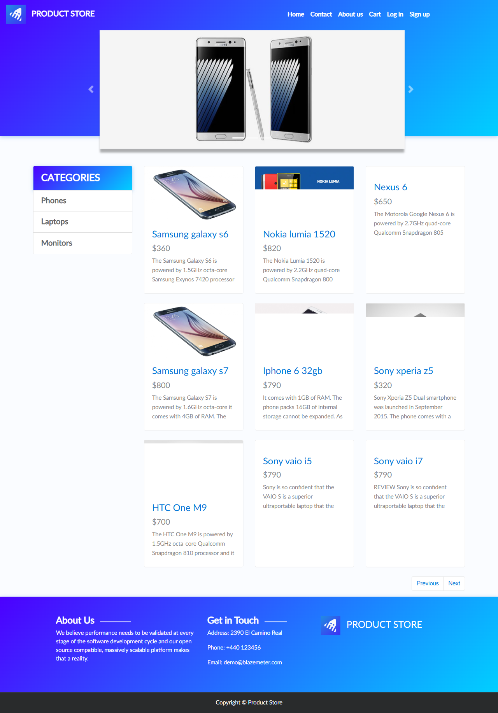

</details>

<details>
<summary><strong>📸 Test 6 · Negación de elementos</strong></summary>

<br>

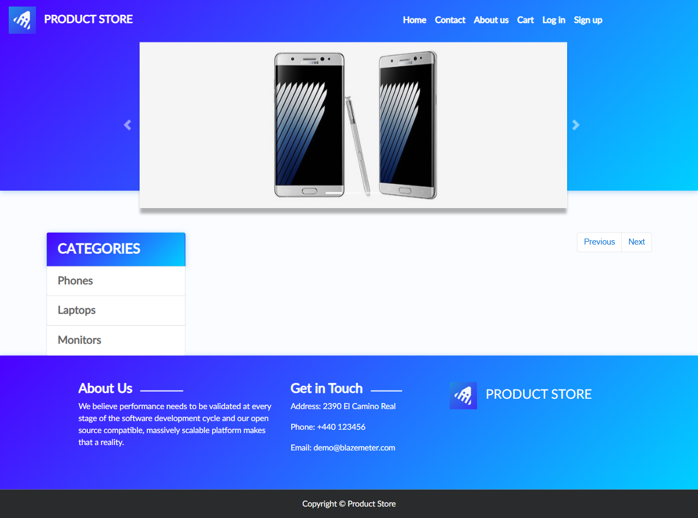

</details>

<details>
<summary><strong>📸 Test 7 · Reto 1 - Place Order con getByRole()</strong></summary>

<br>

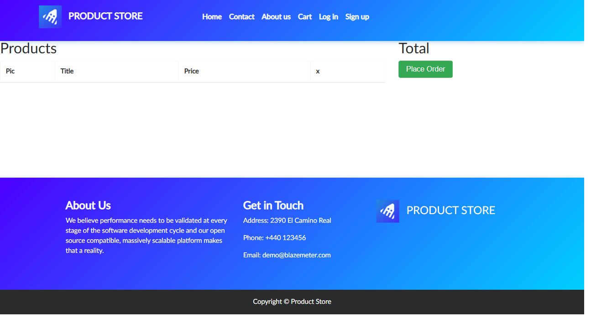

</details>

<details>
<summary><strong>📸 Test 8 · Reto 2 - filter()</strong></summary>

<br>


</details>

<details>
<summary><strong>📸 Test 9 · Reto 3 - atributo parcial</strong></summary>

<br>


</details>

<details>
<summary><strong>✅ Resultado general · 9 pruebas aprobadas</strong></summary>

<br>


</details>

<details>
<summary><strong>📊 Reporte HTML de Playwright</strong></summary>

<br>


</details>

---

## Laboratorio 04 · Actions y flujo funcional en Playwright

> Objetivo: validar flujos funcionales reales de usuario con registro, login, carrito y formularios interactivos.

### Desarrollo del laboratorio

Este laboratorio integró acciones de usuario reales sobre la aplicación, incluyendo registro, autenticación, navegación al carrito y el uso de formularios interactivos para validar comportamientos funcionales completos.

### Pruebas implementadas

| # | Prueba | Estado |
|---|---|---|
| 1 | Registrar un nuevo usuario | ✅ |
| 2 | Login con usuario registrado | ✅ |
| 3 | Flujo login → carrito | ✅ |
| 4 | Login con credenciales incorrectas | ✅ |
| 5 | Reto 1: formulario Place Order | ✅ |
| 6 | Reto 2: cerrar modal con Close y .last() | ✅ |
| 7 | Reto 3: clear() y inputValue() | ✅ |

### Ejecutar laboratorio

```bash
npx playwright test tests/clase04.spec.ts
```

### Evidencias

<details>
<summary><strong>📸 Test 1 · Registrar un nuevo usuario</strong></summary>

<br>

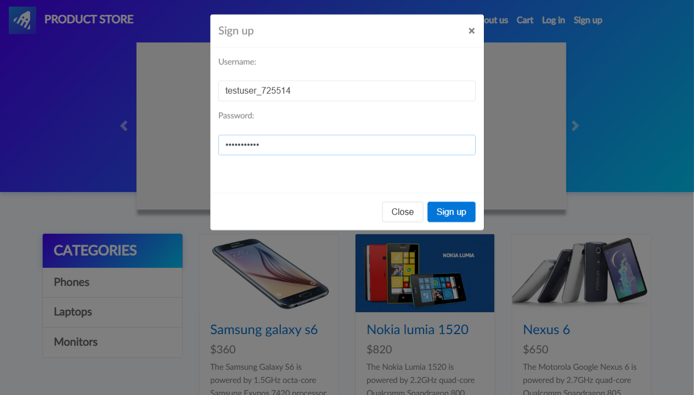

</details>

<details>
<summary><strong>📸 Test 2 · Login con usuario registrado</strong></summary>

<br>


</details>

<details>
<summary><strong>📸 Test 3 · Login → agregar producto → verificar carrito</strong></summary>

<br>

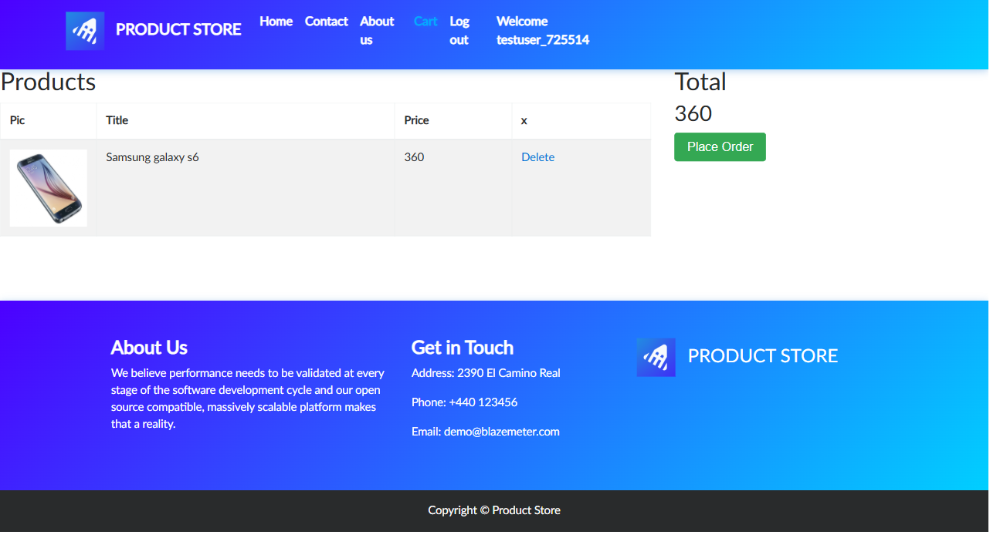

</details>

<details>
<summary><strong>📸 Test 4 · Login con credenciales incorrectas</strong></summary>

<br>


</details>

<details>
<summary><strong>📸 Test 5 · Reto 1 - formulario Place Order con fill()</strong></summary>

<br>

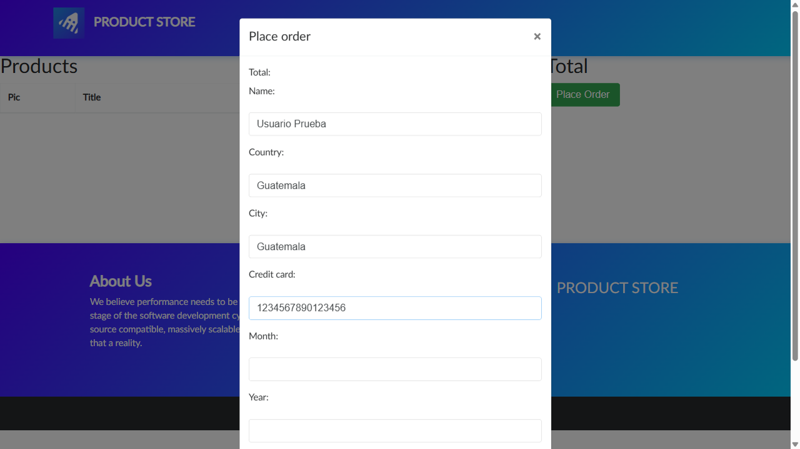

</details>

<details>
<summary><strong>📸 Test 6 · Reto 2 - cerrar modal con Close y .last()</strong></summary>

<br>

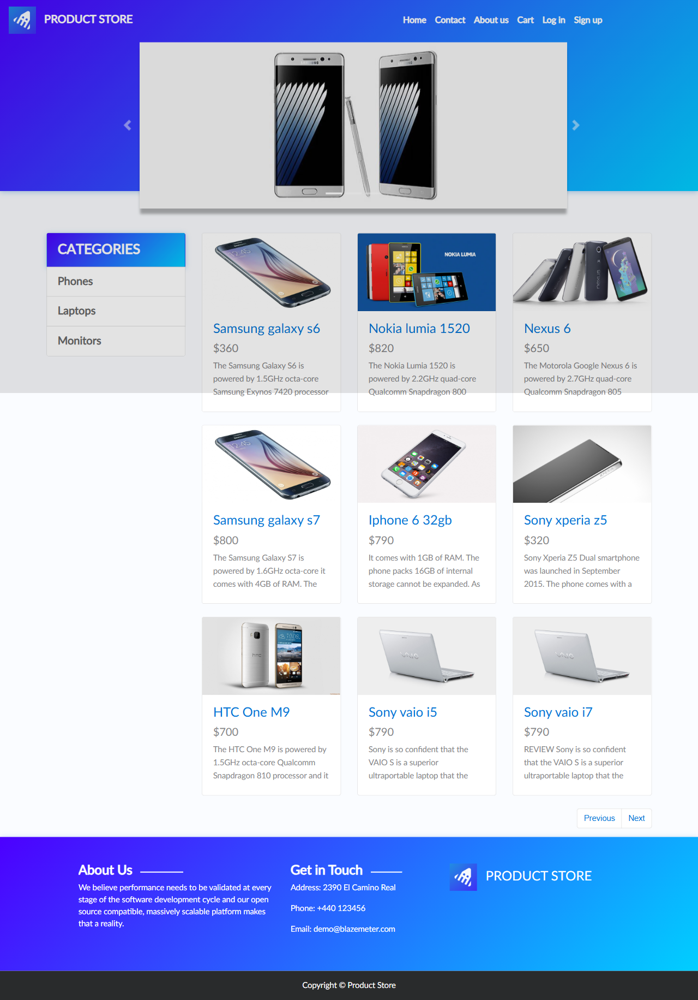

</details>

<details>
<summary><strong>📸 Test 7 · Reto 3 - clear() + inputValue()</strong></summary>

<br>

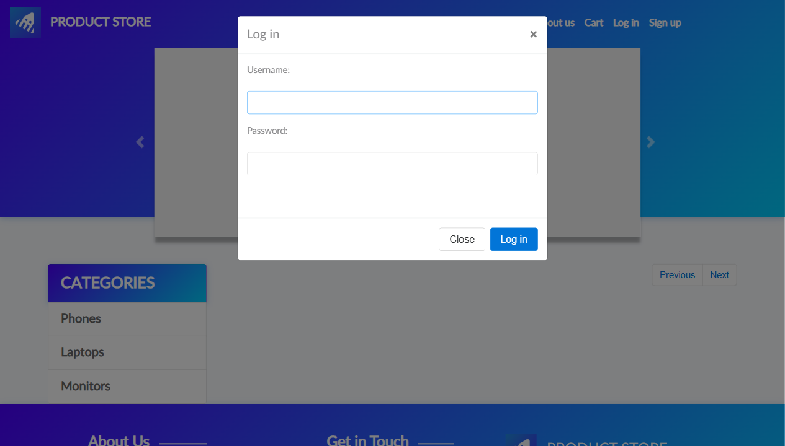

</details>

<details>
<summary><strong>✅ Resultado general · 7 pruebas aprobadas</strong></summary>

<br>

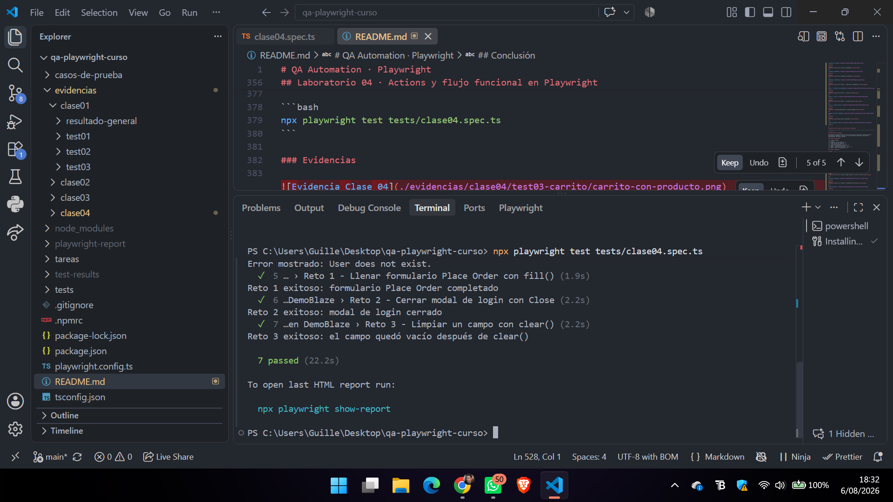

</details>

<details>
<summary><strong>📊 Reporte HTML de Playwright · Clase 04</strong></summary>

<br>

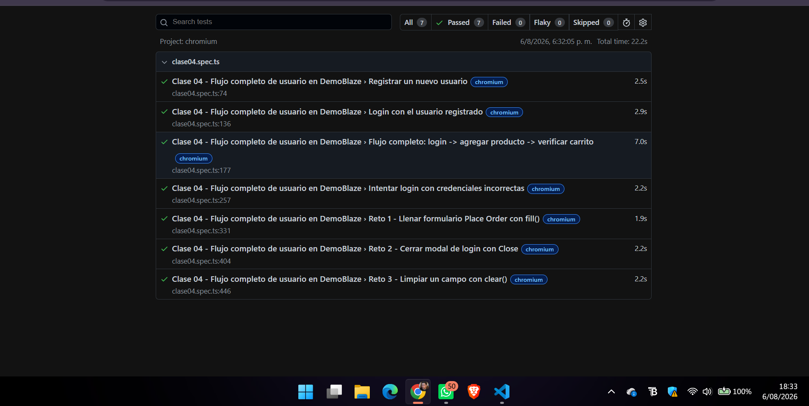

</details>

---

## Evidencias destacadas

La organización de las capturas se realizó de forma estructurada por clase y por prueba, con el propósito de conservar de manera ordenada las evidencias generadas durante la ejecución de cada laboratorio.

- [Evidencias Clase 01](./evidencias/clase01)
- [Evidencias Clase 02](./evidencias/clase02)
- [Evidencias Clase 03](./evidencias/clase03)
- [Evidencias Clase 04](./evidencias/clase04)

---

## Estructura del proyecto

```text
QA-PLAYWRIGHT-CURSO
├── casos-de-prueba/
│   └── TC-001.md
├── evidencias/
│   ├── clase01/
│   ├── clase02/
│   ├── clase03/
│   └── clase04/
├── tareas/
│   └── tarea-04.md
├── tests/
│   ├── clase01.spec.ts
│   ├── clase02.spec.ts
│   ├── clase03.spec.ts
│   └── clase04.spec.ts
├── package.json
├── playwright.config.ts
├── README.md
└── tsconfig.json
```

---

## Ejecución

### Instalación

```bash
npm install
npx playwright install chromium
```

### Ejecutar todas las pruebas

```bash
npx playwright test
```

### Abrir reporte HTML

```bash
npx playwright show-report
```

---

## Documentación adicional

- [Caso de prueba TC-001](./casos-de-prueba/TC-001.md)
- [Tarea 04](./tareas/tarea-04.md)

---

## Conclusión

Este proyecto evidencia la aplicación práctica de pruebas automatizadas con Playwright en un entorno académico, fortaleciendo la trazabilidad, la documentación y la validación funcional de una aplicación web real como DemoBlaze.
