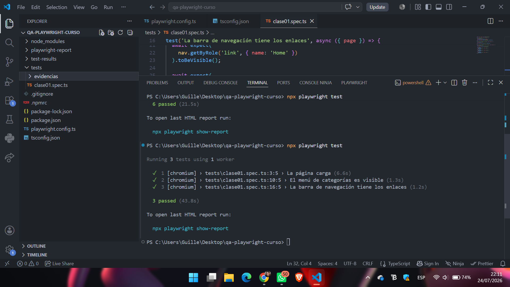
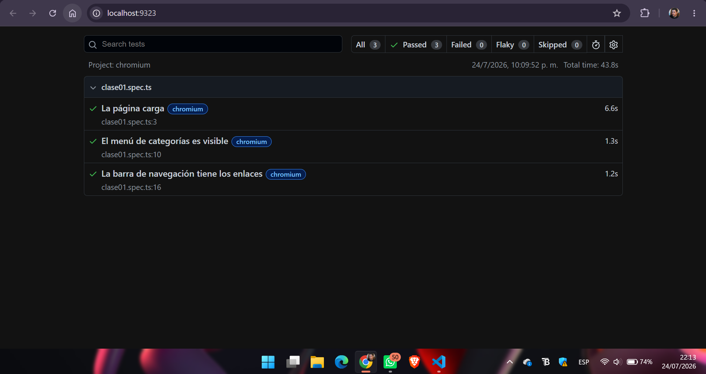
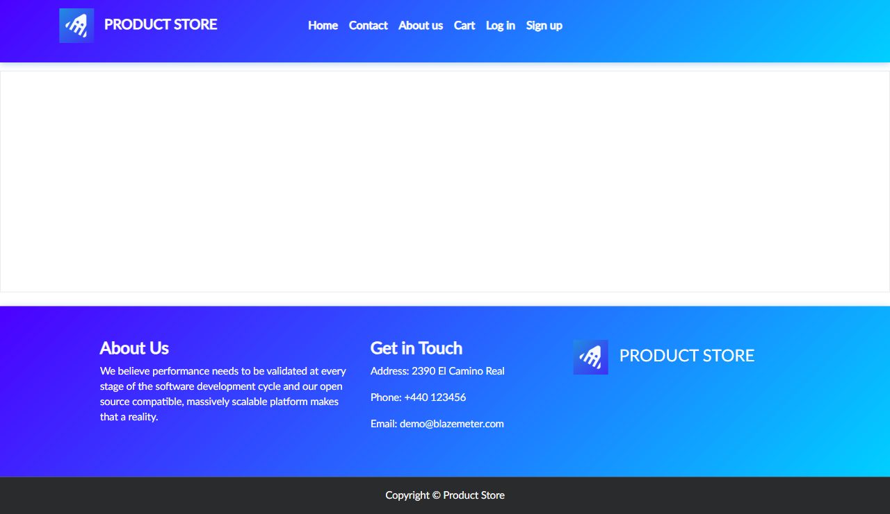
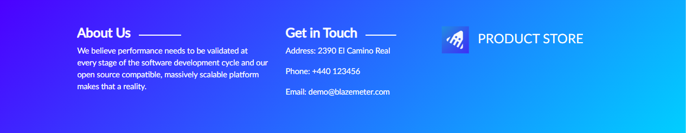
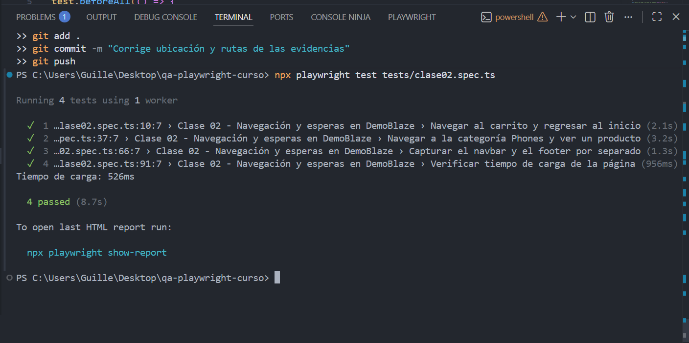

# Proyecto de pruebas automatizadas con Playwright

## Datos del estudiante

- **Nombre:** Guillermo Jose Gomez Aguilera
- **Carné:** 1790-22-16429
- **Curso:** Aseguramiento de la Calidad del Software
- **Versión de Node.js:** v24.18.0

## Descripción del proyecto

Este proyecto fue desarrollado con Playwright y TypeScript para automatizar pruebas funcionales sobre la aplicación web DemoBlaze.

El objetivo principal es aplicar buenas prácticas de aseguramiento de calidad, incluyendo validación de elementos, navegación, capturas de evidencia, esperas automáticas, localizadores semánticos y flujo funcional de usuario.

A lo largo de los laboratorios se documentaron y ejecutaron casos que permiten verificar el comportamiento de la aplicación de forma automatizada.

## Herramientas utilizadas

- Visual Studio Code
- Node.js v24.18.0
- npm
- TypeScript
- Playwright
- Chromium
- Git
- GitHub

---

# Laboratorio 01 - Introducción a Playwright

## Descripción

En este laboratorio se realizaron las primeras pruebas automatizadas sobre DemoBlaze para verificar la carga de la página y la visibilidad de los elementos principales del menú.

## Pruebas realizadas

1. Verificar que la página de DemoBlaze cargue correctamente.
2. Verificar que el menú de categorías sea visible.
3. Verificar que la barra de navegación contenga los enlaces principales.

## Instalación

```bash
npm install
npx playwright install chromium
```

## Ejecución de las pruebas

```bash
npx playwright test
npx playwright show-report
```

## Evidencia de ejecución





## Resultado

Los tres tests correspondientes al primer laboratorio fueron ejecutados correctamente.

---

# Laboratorio 02 - Navegación, esperas y capturas

## Descripción

En este laboratorio se realizaron pruebas para validar la navegación entre páginas, la carga de recursos y la captura de evidencias visuales de la aplicación.

## Pruebas realizadas

1. Navegar desde la página principal hacia el carrito y regresar.
2. Seleccionar la categoría Phones y abrir el detalle de un producto.
3. Capturar por separado la barra de navegación y el pie de página.
4. Verificar que la página principal cargue en menos de 10 segundos.

## Evidencias generadas

- Página principal
- Carrito vacío
- Detalle del producto
- Barra de navegación
- Pie de página
- Resultado general de la clase

## Capturas del Laboratorio 02

### Página principal


### Carrito vacío


### Detalle del producto



### Barra de navegación


### Pie de página



### Tests aprobados



---

# Laboratorio 03 - Locators en Playwright

## Descripción

En esta práctica se utilizaron diferentes tipos de locators de Playwright sobre DemoBlaze para identificar elementos mediante técnicas recomendadas, incluyendo selectores CSS, atributos, locators encadenados y filtros.

## Pruebas realizadas

Se desarrollaron un total de 9 pruebas, correspondientes a 6 ejercicios de clase y 3 retos adicionales.

1. Locator por texto.
2. Locator por CSS.
3. Locator por ID.
4. Locator por atributo.
5. Locators encadenados.
6. Negación de elementos.
7. Reto 1: Locator por rol utilizando getByRole().
8. Reto 2: Locator utilizando filter().
9. Reto 3: Locator mediante selector de atributo parcial.

## Ejecución de los tests de Clase 03

```bash
npx playwright test tests/clase03.spec.ts
npx playwright test tests/clase03.spec.ts --headed
npx playwright show-report
```

## Resultado de ejecución

- Pruebas aprobadas: 9
- Pruebas fallidas: 0
- Pruebas omitidas: 0

## Evidencias de ejecución


## Caso de prueba TC-001

El documento del caso de prueba funcional se encuentra disponible en:

[Ver TC-001 - Agregar al carrito](./casos-de-prueba/TC-001.md)

---

# Laboratorio 04 - Actions y flujo funcional en Playwright

## Descripción

En este laboratorio se trabajó con acciones de usuario sobre la aplicación DemoBlaze, incluyendo registro, login, navegación al carrito, uso de fill(), clear(), click(), manejo de dialogs y verificación de formularios.

## Pruebas realizadas

1. Registrar un nuevo usuario.
2. Login con el usuario registrado.
3. Login -> agregar producto -> verificar carrito.
4. Login con credenciales incorrectas.
5. Reto 1 - Formulario Place Order utilizando fill().
6. Reto 2 - Cerrar modal utilizando Close y .last().
7. Reto 3 - Utilizar clear() y verificar con inputValue().

## Resultado

- Pruebas aprobadas: 7
- Pruebas fallidas: 0

## Ejecución

```bash
npx playwright test tests/clase04.spec.ts
```

---

# Estructura principal del proyecto

```text
QA-PLAYWRIGHT-CURSO
│
├── casos-de-prueba
│   └── TC-001.md
│
├── evidencias
│   ├── clase01
│   │   └── resultado-general
│   │       ├── reporte-playwright.png
│   │       └── tests-pasando.png
│   ├── clase02
│   │   ├── resultado-general
│   │   │   └── 06-tests-clase02-pasando.png
│   │   ├── test01
│   │   │   ├── 01-pagina-inicio.png
│   │   │   └── 02-carrito-vacio.png
│   │   ├── test02
│   │   │   └── 03-detalle-producto.png
│   │   └── test03
│   │       ├── 04-navbar.png
│   │       └── 05-footer.png
│   ├── clase03
│   │   └── resultado-general
│   │       ├── 07-tests-clase03-9-passed.png
│   │       └── 08-reporte-clase03.png
│   └── clase04
│       ├── test01-registro
│       ├── test02-login
│       ├── test03-carrito
│       ├── test04-login-incorrecto
│       ├── test05-reto1
│       ├── test06-reto2
│       ├── test07-reto3
│       └── resultado-general
│
├── tareas
│   └── tarea-04.md
│
├── tests
│   ├── clase01.spec.ts
│   ├── clase02.spec.ts
│   ├── clase03.spec.ts
│   └── clase04.spec.ts
│
├── .gitignore
├── .npmrc
├── package-lock.json
├── package.json
├── playwright.config.ts
├── README.md
└── tsconfig.json
```

---

# Ejecución general del proyecto

```bash
npm install
npx playwright install chromium
npx playwright test
npx playwright show-report
```

---

# Conclusión

Los laboratorios realizados permitieron aplicar diferentes funcionalidades de Playwright para la automatización de pruebas sobre DemoBlaze.

Se trabajó con validación de elementos, navegación, capturas de evidencia, esperas automáticas, localizadores semánticos, selectores CSS, identificadores, atributos, locators encadenados, filtros y flujos funcionales de usuario.