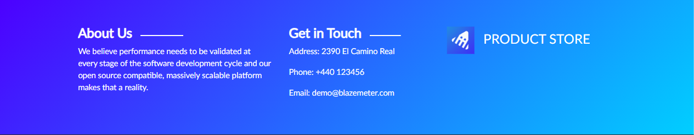
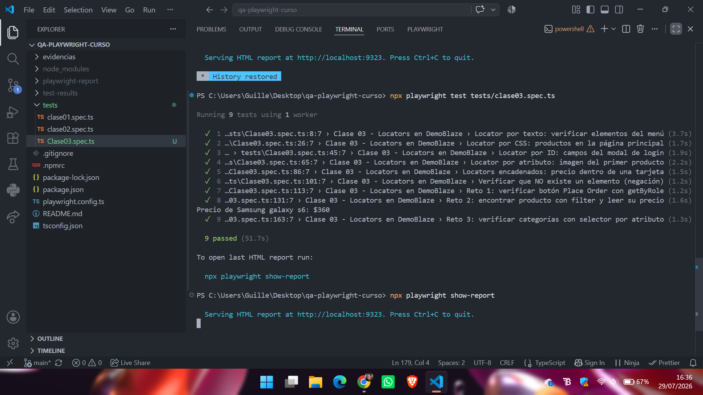
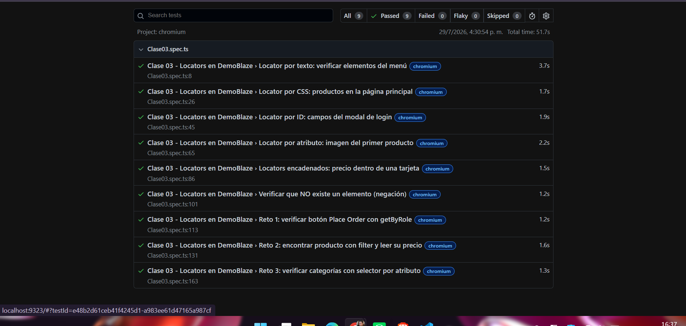

# Proyecto de pruebas automatizadas con Playwright

## Datos del estudiante

- **Nombre:** Guillermo Jose Gomez Aguilera
- **Carné:** 1790-22-16429
- **Curso:** Aseguramiento de la Calidad del Software
- **Versión de Node.js:** v24.18.0

## Descripción del proyecto

Este proyecto fue desarrollado utilizando Playwright con TypeScript para realizar pruebas automatizadas sobre la aplicación web DemoBlaze.

El objetivo del proyecto es aplicar diferentes técnicas de automatización de pruebas, incluyendo validación de elementos, navegación, capturas de evidencias, esperas automáticas y utilización de diferentes tipos de locators.

A lo largo de los laboratorios se han desarrollado diferentes casos de prueba que permiten comprobar el comportamiento y los elementos principales de la aplicación.

## Herramientas utilizadas

- Visual Studio Code
- Node.js v24.18.0
- npm
- TypeScript
- Playwright
- Chromium
- Git
- GitHub

---

# Laboratorio 01 - Introducción a Playwright

## Descripción

En este laboratorio se realizaron las primeras pruebas automatizadas utilizando Playwright sobre la aplicación web DemoBlaze.

## Pruebas realizadas

Se desarrollaron tres pruebas automatizadas:

1. Verificar que la página de DemoBlaze cargue correctamente.
2. Verificar que el menú de categorías sea visible.
3. Verificar que la barra de navegación contenga los enlaces principales.

## Instalación

Para instalar las dependencias del proyecto:

```bash
npm install
```

Para instalar Chromium:

```bash
npx playwright install chromium
```

## Ejecución de las pruebas

Para ejecutar todos los tests:

```bash
npx playwright test
```

Para abrir el reporte HTML:

```bash
npx playwright show-report
```

## Evidencia de ejecución

La siguiente imagen muestra los tres tests ejecutándose correctamente:


### Reporte de Playwright


## Resultado

Los tres tests correspondientes al primer laboratorio fueron ejecutados correctamente utilizando Playwright y Chromium.

---

# Laboratorio 02 - Navegación, esperas y capturas

## Descripción

En este laboratorio se realizaron pruebas automatizadas sobre la aplicación web DemoBlaze utilizando Playwright y TypeScript.

Las pruebas permiten navegar entre diferentes páginas, esperar la carga de elementos, capturar evidencias y medir el tiempo de carga de la página principal.

## Pruebas realizadas

1. Navegar desde la página principal hacia el carrito y regresar.
2. Seleccionar la categoría Phones y abrir el detalle de un producto.
3. Capturar por separado la barra de navegación y el pie de página.
4. Verificar que la página principal cargue en menos de 10 segundos.

## Evidencias generadas

Durante la ejecución se generaron cinco capturas de pantalla:

- `01-pagina-inicio.png`
- `02-carrito-vacio.png`
- `03-detalle-producto.png`
- `04-navbar.png`
- `05-footer.png`

## Preguntas de reflexión

### 1. ¿Cuántas capturas se generaron?

Se generaron cinco capturas. Dos corresponden a la navegación entre la página principal y el carrito, una corresponde al detalle de un producto y dos capturan por separado el navbar y el footer.

### 2. ¿Qué diferencia existe entre `fullPage: true` y una captura normal?

La opción `fullPage: true` captura toda la página web, incluyendo el contenido que se encuentra fuera del área visible y que normalmente requiere desplazamiento.

Una captura normal de la página registra únicamente el área visible del navegador. Cuando se utiliza `locator.screenshot()`, Playwright captura únicamente el elemento seleccionado, como el navbar o el footer.

### 3. ¿Por qué es importante capturar evidencias en las pruebas de software?

Las evidencias permiten demostrar que las pruebas fueron ejecutadas y documentar el estado de la aplicación durante la evaluación.

También ayudan a identificar errores, comparar resultados y facilitar la revisión del trabajo realizado.

## Reflexión sobre auto-wait y sleep()

Playwright implementa `auto-wait` porque las páginas web no siempre cargan todos sus elementos inmediatamente.

Antes de realizar una acción, Playwright espera automáticamente que el elemento esté visible, estable, habilitado y disponible para recibir la interacción.

En cambio, `sleep()` utiliza un tiempo fijo. Si se establece una espera demasiado corta, el elemento puede no estar listo y la prueba puede fallar. Si se establece una espera demasiado larga, la prueba perderá tiempo aunque el elemento ya se encuentre disponible.

La principal ventaja del `auto-wait` es que permite crear pruebas más estables, rápidas y confiables. Playwright espera solamente el tiempo necesario y reduce los fallos causados por diferencias en la velocidad de la red, el navegador o la computadora.

## Capturas del Laboratorio 02

### Página principal


### Carrito vacío


### Detalle del producto


### Barra de navegación


### Pie de página



### Tests aprobados


---

# Laboratorio 03 - Locators en Playwright

## Descripción

En esta práctica se utilizaron diferentes tipos de locators de Playwright sobre la aplicación DemoBlaze.

El objetivo fue identificar elementos utilizando técnicas recomendadas por Playwright, así como practicar selectores CSS, atributos, locators encadenados, negaciones y técnicas adicionales mediante los retos propuestos.

## Pruebas realizadas

Se desarrollaron un total de **9 pruebas**, correspondientes a los 6 ejercicios de clase y los 3 retos solicitados.

1. Locator por texto.
2. Locator por CSS.
3. Locator por ID.
4. Locator por atributo.
5. Locators encadenados.
6. Negación de elementos.
7. Reto 1: Locator por rol utilizando `getByRole()`.
8. Reto 2: Locator utilizando `filter()`.
9. Reto 3: Locator mediante selector de atributo parcial.

## Retos realizados

### Reto 1 - Locator por rol

Se verificó la existencia y visibilidad del botón **Place Order** dentro del carrito utilizando:

```typescript
page.getByRole('button', { name: 'Place Order' })
```

### Reto 2 - Locator con filter()

Se localizó específicamente el producto **Samsung galaxy s6** entre las tarjetas disponibles utilizando `filter()`.

Además, se obtuvo el precio del producto, obteniendo como resultado:

```text
Precio de Samsung galaxy s6: $360
```

### Reto 3 - Locator por atributo parcial

Se verificaron las tres categorías principales del sidebar:

- Phones
- Laptops
- Monitors

Para ello se utilizó un selector basado en un atributo compartido por los enlaces de categoría.

## Ejecución de los tests de Clase 03

Para ejecutar únicamente las pruebas correspondientes al Laboratorio 03:

```bash
npx playwright test tests/clase03.spec.ts
```

Para ejecutar las pruebas mostrando el navegador:

```bash
npx playwright test tests/clase03.spec.ts --headed
```

Para mostrar el reporte HTML generado por Playwright:

```bash
npx playwright show-report
```

## Resultado de ejecución

Los 9 casos de prueba fueron ejecutados correctamente.

- **Pruebas aprobadas:** 9
- **Pruebas fallidas:** 0
- **Pruebas omitidas:** 0

## Evidencias de ejecución

### Pruebas aprobadas

La siguiente captura muestra la ejecución de los 9 tests desde la terminal de Visual Studio Code.



### Reporte HTML de Playwright

La siguiente evidencia muestra el reporte generado por Playwright, donde se observa que los 9 casos fueron aprobados correctamente.



## Caso de prueba TC-001

Como parte del entregable se documentó el caso de prueba funcional:

**TC-001 - Agregar un producto al carrito**

El caso verifica que un producto pueda ser seleccionado, agregado al carrito y posteriormente encontrado dentro de la lista de productos del carrito.

El documento se encuentra disponible en:

[Ver TC-001 - Agregar al carrito](./casos-de-prueba/TC-001.md)

## Aplicación utilizada

Las pruebas fueron realizadas sobre la aplicación:

**DemoBlaze**

https://www.demoblaze.com/

---

# Estructura principal del proyecto

```text
QA-PLAYWRIGHT-CURSO
│
├── casos-de-prueba
│   └── TC-001.md
│
├── evidencias
│   ├── 01-pagina-inicio.png
│   ├── 02-carrito-vacio.png
│   ├── 03-detalle-producto.png
│   ├── 04-navbar.png
│   ├── 05-footer.png
│   ├── 06-tests-clase02-pasando.png
│   ├── 07-tests-clase03-9-passed.png
│   ├── 08-reporte-clase03.png
│   ├── reporte-playwright.png
│   └── tests-pasando.png
│
├── tests
│   ├── clase01.spec.ts
│   ├── clase02.spec.ts
│   └── clase03.spec.ts
│
├── .gitignore
├── .npmrc
├── package-lock.json
├── package.json
├── playwright.config.ts
├── README.md
└── tsconfig.json
```

---

# Ejecución general del proyecto

Para instalar las dependencias:

```bash
npm install
```

Para instalar Chromium:

```bash
npx playwright install chromium
```

Para ejecutar todas las pruebas:

```bash
npx playwright test
```

Para ejecutar una clase específica:

```bash
npx playwright test tests/clase03.spec.ts
```

Para visualizar el reporte HTML:

```bash
npx playwright show-report
```

---

# Conclusión

Los laboratorios realizados permitieron aplicar diferentes funcionalidades de Playwright para la automatización de pruebas sobre DemoBlaze.

Se trabajó con validación de elementos, navegación, capturas de evidencia, esperas automáticas, localizadores semánticos, selectores CSS, identificadores, atributos, locators encadenados y filtros.

En el Laboratorio 03 se completaron satisfactoriamente los **6 ejercicios de clase y los 3 retos adicionales**, obteniendo un resultado final de **9 pruebas aprobadas y 0 fallidas**.